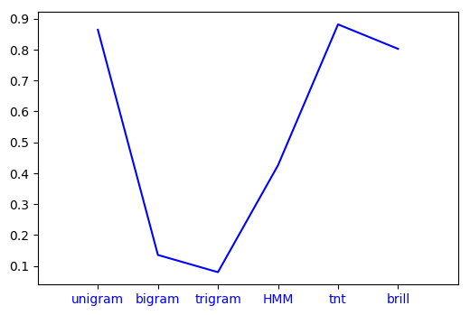
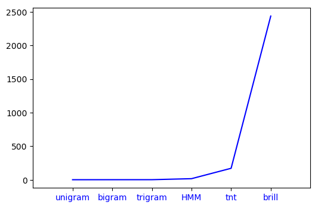

This post compares the various Part of Speech Taggers when taken individually in terms of the time taken by them and their accuracy. 

---
# POS Taggers

**Part of Speech Tagging** refers to marking a word in a text with its corresponding part of speech, based on both the definition and context. 

Basic Types of POS Taggers:

* **N-Gram Taggers**: Unigram, Bigram, Trigram taggers and so on. 
* **HMM Tagger**: A tagger based on Hidden Markov Models. 
* **Brill Tagger**: A supervised-learning tagger th reduce the error
* **TnT Tagger**: TnT stands for Trigrams'n'Tags
* **Regex Tagger**: Regex Based Tagger meant for Tagging based on word inflections.
* **Default Tagger**: Return a default tag for every word. 

#### What goes up for evaluation? 
Six POS Taggers would go up for evaluation. A brief description for each tagger has been enclosed under their respective subheadings. 

The corpus chosen for the purpose is the TreeBank corpus. The Brown corpus didn't yield results with TnT and HMM tagger. The following code snippet shows the loading of the dataset and it's splitting 

```python
import nltk
from nltk.tag import hmm
from nltk.corpus import treebank
from nltk.tag.brill import *
import nltk.tag.brill_trainer as bt
from nltk.tag import tnt
import time 

size = int(len(treebank.tagged_sents())*0.9)
train = treebank.tagged_sents()[:size]
test = treebank.tagged_sents()[size:]
```
Time is measured using the time module
```python 
import time
"""
Code Snippet whose time is to be measured. 

"""
end = time.time()
start = time.time()
timeElapsed = end-start
```
##### Unigram Tagger
***Unigram Tagger*** tags each token with the tag that is most likely to go with the token’s type based on a training corpus. 
```python
ug = nltk.UnigramTagger(train)
print(ug.evaluate(test))
results.append(ug.evaluate(test))
```

##### Bigram Tagger 
In addition to considering the token’s type, a ***Bigram Tagger*** also brings into consideration the part-of-speech tag of the preceding token.
```python
bg = nltk.BigramTagger(train)
print(bg.evaluate(test))
results.append(bg.evaluate(test))
```
##### Trigram Tagger 
In addition to considering the token’s type, a ***Trigram Tagger*** also brings into consideration the part-of-speech tags of the preceding two tokens.
```python
tg = nltk.TrigramTagger(train)
print(tg.evaluate(test))
results.append(tg.evaluate(test))
```
##### HMM Tagger 
An HMM-based POS Tagging method
```python
from nltk.tag import hmm

trainer = hmm.HiddenMarkovModelTrainer()
tagger = trainer.train_supervised(train)
print(tagger.evaluate(test))
results.append(tagger.evaluate(test))
```
##### TnT Tagger 
 
```python
from nltk.tag import tnt

tnt_tagger = tnt.TnT()
tnt_tagger.train(train)
print(tnt_tagger.evaluate(test))
results.append(tnt_tagger.evaluate(test))
```
##### Brill Tagger 
There are a lot of Brill Tagger implementions and versions. This is one of the more accurate versions from what I have read in comparison to the FastBrillTagger. However given the amount of time it takes to train, I am not a huge fan. 
```python
from nltk.tag.brill import *
import nltk.tag.brill_trainer as bt

Template._cleartemplates()
templates = fntbl37()
defaultTagger = nltk.DefaultTagger('NN')
tagger = bt.BrillTaggerTrainer(defaultTagger, templates, trace=3)
tagger = tagger.train(train, max_rules=250)
print(tagger.evaluate(test))
results.append(tagger.evaluate(test))
```

***How did we measure the time for a particular tagger?***
We took the code for training and testing the tagger into consideration while evaluating the time taken. 

A glimpse at the code for UnigramTagger
```python
start = time.time()
ug = nltk.UnigramTagger(train)
print(ug.evaluate(test))
end = time.time()
print(end - start)
time_taken.append(end - start)
``` 

#### The Results 

| Tagger || Time Taken(sec) || Accuracy |
------------ || ------------- || ------------- |
| Unigram  ||  2.6861190795898438  ||  0.8639185750636132 |
| Bigram  ||  3.0700016021728516  ||  0.13567430025445293 |
| Trigram  ||  3.2834136486053467  ||  0.08 |
| HMM  ||  18.131709337234497  ||  0.4255470737913486 |
| TnT  ||  172.80279874801636  ||  0.881323155216285 |
| Brill  ||  2437.3220386505127  ||  0.7363867684478371 |
{:.mbtablestyle}
	

##### Accuracy of Taggers 


##### Time Taken By Taggers


The next post deals with Regex and Default Taggers, along with their roles serving as a backoff tagger. 