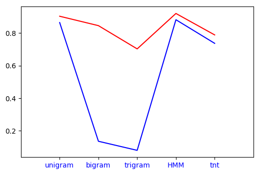

This post compares the various Part of Speech Taggers when taken individually in terms of the time taken by them and their accuracy. 

---
# Regex Tagger

Let us begin by introducing the ***Default Tagger***. The default tagger allots a default value, mostly "NN" to all the (untagged) tokens. 

What purpose does that serve? 

In a sentence singular Nouns like ***Manish*** or ***Samriddhi*** are very hard to tag. They usually go untagged when a vast majority of the POS Taggers are applied and thereby compromising on the accuracy.

The Default Tagger helps us make an intelligent guess thereby significantly improving the accuracy rating. It is pretty useless on it's own but has tremendous potential as a backoff. 

```python
import nltk
defaultTagger = nltk.DefaultTagger('NN')
``` 
The Regex also is another one of those Taggers which can serve no purpose on it's own, however as a Backoff they can make drastic improvements in the accuracy scores. 

#### Implementation of a Regex Tagger
``` python 
import nltk
patterns = [(r'.*ed$', 'VBD'),
(r'.*es$', 'VBZ'),(r'.*ould$', 'MD'),
(r'.*\’s$', 'NN$'),
(r'.*s$', 'NNS'),
(r'(The|the|A|a|An|an)$', 'AT'),
(r'.*able$', 'JJ'),
(r'.*ly$', 'RB'),
(r'.*s$', 'NNS'),
(r'^-?[0-9]+(.[0-9]+)?$', 'CD'),
(r'.*', 'NN')]
regexpTagger = nltk.RegexpTagger(patterns)
```
The main purpose of Regex taggers are

* To detect and tag numerical entities: Its very difficult to make other POS Tagger
* To tag according to detected inflection. This comes in very handy while tagging. Especially in languages like Hindi and Bengali where strong inflection based rules are present (Hindi has 150+ rules), accuracy ratings of around 0.4-0.6 can be achieved based on the Regex Taggers  alone. 

#### Studying the Effects of Regex Taggers 

We are going to check how the Regex Tagger improves the accuracy of other taggers when used as a backoff along with the Default tagger.
Code Snippet 
```python
tag1 = nltk.RegexpTagger(patterns, backoff = defaultTagger)
tag2 = nltk.UnigramTagger(train, backoff= tag1)
tag3 = nltk.BigramTagger(train, backoff= tag1)  
tag4 = nltk.TrigramTagger(train, backoff= tag1)

tag5 = tnt.TnT()
tag5.train(train)
tag5 = tnt.TnT(unk = tag1, Trained=True )
tag5.train(train)

Template._cleartemplates()
templates = fntbl37()
tag6 = bt.BrillTaggerTrainer(tag1, templates, trace=3)
tag6 = tag6.train(train, max_rules=250)

print(tag1.evaluate(test)) #0.24274809160305344
print(tag2.evaluate(test)) #0.9026972010178117
print(tag3.evaluate(test)) #0.8449872773536896
print(tag4.evaluate(test)) #0.7023918575063614
print(tag5.evaluate(test)) #0.9196946564885496
print(tag6.evaluate(test)) #0.788091603053435
```
The results have been highlighted below. We can see the significant increase the Regex Tagger contributes to in case of simple taggers which tag on the basis of simple rules. However we also see that it is unable to improve the scores of Taggers based on Probabilistic and Statistical models much as they leave very few untagged tokens which can be taken up by the backoff tagger.

| Tagger || Backoff Tagger || Individual Tagger |
| ------------ || ------------- || ------------- |
| Unigram  || 0.9026972010178117  ||  0.8639185750636132 |
| Bigram  ||  0.8449872773536896  ||  0.13567430025445293 |
| Trigram  || 0.7023918575063614  ||  0.08 |
| TnT  ||  0.9196946564885496  ||  0.881323155216285 |
| Brill  ||  0.788091603053435  ||  0.7363867684478371 |

The graph for the accuracy results is as shown below 


In the next post I will build two Backoff Taggers while aiming to get an accuracy score above 0.95.